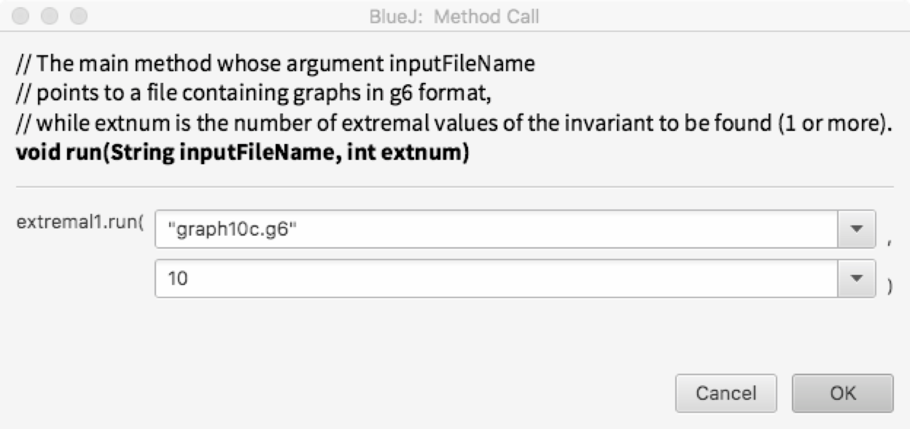
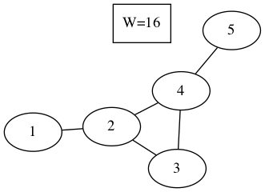

.. graph6java documentation master file, created by
   sphinx-quickstart on Thu Jun  7 10:09:07 2018.
   You can adapt this file completely to your liking, but it should at least
   contain the root `toctree` directive.

Welcome to graph6java documentation!
======================================

This documentation is excerpted from a preprint 
"Researcher-friendly Java framework for testing conjectures in chemical graph theory",
written by M. Ghebleh, A. Kanso and D. Stevanovic.

============
Introduction
============

Graph theorists usually study properties of graphs from certain classes.
Brendan McKay's package `nauty <http://pallini.di.uniroma1.it/>`_ provides 
a generally accepted way of generating sets of smaller graphs
constrained for connectedness, number of vertices or
ranges of the numbers of edges or vertex degrees.
Programs are available for generating other classes of graphs as well,
most widely known of which are certainly 
`Buckygen <http://caagt.ugent.be/buckygen/>`_ and
`fullgen <https://users.cecs.anu.edu.au/~bdm/plantri/>`_ for generating fullerenes,
and `plantri <https://users.cecs.anu.edu.au/~bdm/plantri/>`_ for generating other planar graphs.
Actually, many sets of graphs are already generated and 
ready for download in nauty's graph6 format
either from the `House of Graphs <http://hog.grinvin.org>`_
or the web pages of mathematicians like 
`Brendan McKay <http://users.cecs.anu.edu.au/~bdm/data/graphs.html>`_ and 
`Gordon Royle <http://staffhome.ecm.uwa.edu.au/~00013890/>`_.
Research questions that are often studied on such sets of graphs
involve calculation of invariants and selection of particular graphs or pair of graphs
and may have some of the following forms:

* What are the values of certain invariants (*such as energy and nullity*) 
  for graphs in a given set?
* Which graphs in a given set satisfy certain constraints
  (*such as having the Laplacian energy equal to that of a complete graph*)?
* Which graphs attain the maximum or the minimum value 
  of a given invariant expression (*such as the distance-sum heterogeneity index*)
  under certain constraints (*such as fixed number of edges*)?
* Which pairs of graphs have the same value of an invariant expression
  (*such as equal energies*)?
* Which pairs of graphs have similar values of one invariant expression,
  but dissimilar values of another invariant expression
  (*such that the difference of their Wiener indices is 
  smaller than the difference of their Randi\'c indices*)?

To answer questions like these it is beneficial to be able
to quickly set up numerical tests to be performed over sets of graphs.
We describe here a Java framework that we have developed for this purpose.
The framework is based on our existing experience with graph computations and
it provides general templates for dealing with the above research questions.
Templates are organised so as 
to enable graph theorists with little to no programming experience
to easily adapt them to their own question variants,
run them for a given set of graphs in graph6 format,
visualise the selected graphs and, eventually,
develop deeper intuition about the behavior of studied graph invariants.

Before starting with descriptions of framework and its use,
let us briefly explain a few main reasons for our choice of Java over other programming languages:
its speed, a large number of useful libraries and existence of a simple development environment.
First, while Java may not be as fast as C or C++, its speed is still comparable to them,
and on the other hand, 
it is substantially faster than interpreted languages such as Python, Matlab (Octave) or Mathematica.
Next, Java has a large number of useful libraries,
some already included in its distribution
and some freely downloadable from the internet.
Its collection library, for example, enables 
to quickly sort graphs by invariant values or to use invariant values as keys in maps
to instantly discover graphs with the same or similar invariant values,
while the graph6 archive is being processed.
The `Colt <http://dst.lbl.gov/ACSSoftware/colt/>`_ library, on the other hand, 
offers data structures optimized for eigenvalue calculations with both dense and sparse matrices.
Above all, 
Java offers a simple integrated development environment `BlueJ <http://www.bluej.org/>`_,
stripped of overwhelming user interfaces of professional development environments 
such as NetBeans or Eclipse,
enabling its users to get started more quickly,
as can be evidenced from its rather short `manual <https://www.bluej.org/tutorial/tutorial-v4.pdf>`_.
BlueJ is specifically designed for teaching first programming course to undergraduate students 
(and non-computer science researchers as well),
and is followed by an excellent introductory book to programming in Java
(D.J. Barnes, M. Kolling, Objects First with Java, A Practical Introduction using BlueJ, Pearson, 2016),
which is gladly recommended for further reading,
as certain knowledge of Java programming is needed for more creative uses of the framework.

=================
Preliminary setup
=================

In order to use the framework as intended, 
installation of several pieces of software is necessary.

-----------------------------------------
BlueJ, Colt and the framework source code
-----------------------------------------

BlueJ is needed to edit and run the framework source files.
Download the appropriate installer from https://www.bluej.org/ and install it.
If you have downloaded BlueJ for Windows or Mac OS X,
the installer already contains Java development kit (JDK),
necessary for compilation of the framework source files.
If you have downloaded BlueJ for another operating system,
you need to ensure that you have JDK installed on your system as well.
You may quickly check this by opening up a terminal window on your system
and typing ``javac`` in it.
If the terminal window replies with a lengthy help message on how to use ``javac``, 
you have Java compiler installed.
Otherwise, download and install JDK from 
http://www.oracle.com/technetwork/java/javase/downloads/index.html.

The framework files may be downloaded as a zip archive from 
`Zenodo <https://doi.org/10.5281/zenodo.1244000>`_.
When unzipped, you get a folder with the framework source files
and a copy of **colt.jar**, a Java library for eigenvalue calculations.
BlueJ has to be instructed to load **colt.jar**,
which is done by selecting **Preferences** command
from either **Tools** menu under Windows or **BlueJ** menu under OS X,
selecting **Libraries** tab in the newly opened window,
clicking on **Add File** and choosing **colt.jar** from the standard file open dialog.

Since the framework consists of source files that need to be edited for each conjecture separately,
it may be a good idea to leave the folder with original source files intact
and make a new copy of that folder for each new conjecture to be tested.
Once that is done, you may open a copy of the framework in **BlueJ**
by selecting **Open Project** command from **Project** menu
and then opening the folder containing the framework copy from the standard file open dialog
(to avoid confusion, 
note that you have to select and open the actual folder and not any individual file).

.. figure:: fig-bluej-bw.png
   
   BlueJ window: Java classes containing program code are shown in the main part,
   with arrows depicting dependence of one class on another class.
   The compile button is situated on the left side,
   while the object bench is placed at the bottom of the window.

The main part of the BlueJ window contains classes of the current project,
represented by named rectangles,
which can be opened for editing by double-clicking.
Whenever source code has been edited, 
it needs to be recompiled by clicking **Compile** button.
Afterwards,
you can right-click on a class rectangle and choose ``new <Class\_name>()``
to create a new object of a given class,
which will then be shown as a rounded rectangle at the bottom of the window,
in the so-called object bench.
Right-clicking an object in the object bench gives the option to call object methods,
including ``void run(String inputFileName, ...)``,
the main method in each framework template.
BlueJ then opens a dialog, as shown below,
that asks for values of the method arguments,
where ``inputFileName`` denotes the file with a set of graphs in graph6 format.
Note that ``inputFileName``, as a Java string, 
has to be entered with enclosing double quotation marks, 
and that the program expects the file to be found in the framework directory
(unless the full path to it is typed in ``inputFileName`` as well).

   Entering arguments for an object method.

-----------------------------------------
Sets of graphs in graph6 format and nauty
-----------------------------------------

Graph6, devised by Brendan McKay, is a format for describing graphs that originated in pre-WWW times
when data had to be written using printable ASCII characters
in order to be sent efficiently through e-mail.
Basically, assuming that you deal with a simple graph,
it starts with the upper half of its adjacency matrix (without a zero diagonal),
lists the columns consecutively to obtain an array of bits
and then divides this array into chunks of 6 bits each (hence the name graph6).
The 6-bit numbers obtained in this way are added to 63
in order to produce visible ASCII characters
(going from **?** through capital letters and small letters to **~**).
The resulting file then consists of lines, one for each graph,
where the first character represents the number of vertices, also added to 63,
and the remaining characters in the line encode the adjacency matrix as described.

Quite a few sets of graphs in graph6 format are available online
from several reliable web pages: 

* Brendan McKay at http://cs.anu.edu.au/~bdm/data/graphs.html
  has posted, among others, sets of small simple, Eulerian and planar graphs;

* Gordon Royle at http://www.maths.uwa.edu.au/~gordon/data.html
  has posted, among others, sets of small trees, bipartite graphs, cubic graphs;

* the House of Graphs at https://hog.grinvin.org/MetaDirectory.action
  has a metadirectory with access to several further sets of graphs.

In cases when you need a set of graphs that is not available online,
new sets can be created using ``geng`` or ``genbg`` tools from **nauty** package.
It is foreseen that the source code of **nauty**
is downloaded from http://pallini.di.uniroma1.it/ and compiled locally.
This is usually not an issue for non-Windows users:
just use short instructions provided at this site.
If you happen to work on a Windows machine, 
a combination of ``Code::Blocks IDE <http://www.codeblocks.org/>`_ and 
GCC compiler such as ``mingw-w64 <http://mingw-w64.org/doku.php/download>`_
should get you started.

**nauty** tools are used from the command line.
General format for ``geng`` command is::

  geng [-options] n [mine[:maxe]] [file]

where brackets ``[]`` denote optional arguments,
``n`` denotes the number of vertices,
``mine`` and ``maxe`` the minimum and maximum number of edges,
while ``file`` denotes the name of the output file.
The most often used options are ``-c`` to generate connected graphs,
``-d#`` for the minimum vertex degree, where ``#`` denotes a number, 
and ``-D#`` for the maximum vertex degree.
Here are a few examples:

* ``geng -c 9 graph9c.g6`` to generate connected graphs on 9 vertices
* ``geng -c 19 18:18 trees19.g6`` to generate trees on 19 vertices
* ``geng -cd3D3 16 cubic16.g6`` for connected cubic graphs on 16 vertices
* ``geng -cD4 11 chem11.g6`` for connected chemical graphs on 11 vertices

See ``geng -help`` for list of other options.
``genbg`` is used similarly as it can be evidenced from ``genbg -help``.

You can also automate generation of graph sets.
For example,
if you wish to generate connected 10-vertex graphs
classified in files by their number of edges,
you may use::

  for i in \{9..45\``; do geng -c 10 \$\{i\``:\$\{i\`` graph10e\$\{i\``.g6; done
  
in Unix-based terminal (Mac OS X, Linux), and::

  for /L \%i in (9,1,45) do geng -c 10 \%i:\%i graph10e\%i.g6

in Windows command line.

-------------------------------------
Visualisation of graphs with Graphviz
-------------------------------------

Graphviz is a well developed software package for visualisation of graphs.
It can be downloaded from http://www.graphviz.org and, after successful installation,
it offers a number of command-line tools that produce 
an image of a graph from a text file with its description.
Such description mainly consists of the list of edges,
with various options to additionally describe 
visual properties of vertices and edges.
An example of a description of a small 5-vertex graph is shown below,
which uses a small trick to force Graphviz 
to show further information about the graph (in this case its Wiener index) 
within the resulting image
by specifying an isolated vertex with that information as a label::

     Graph {
       1 -- 2
       2 -- 3
       2 -- 4
       3 -- 4
       4 -- 5
       v [shape=box, label="W=16"]
     ``

   Visual representation of the graph above produced by **neato**.

Graphviz tools implement several well known graph drawing algorithms.
For small undirected graphs perhaps the most useful among them is **neato**,
based on minimisation of energy of the graph spring model 
(see T. Kamada, S. Kawai, An algorithm for drawing general undirected graphs,
Inf. Process. Lett. 31 (1989), 7-15.).
General format of **neato** command is::

  neato [-options] dotfile > outputfile

where ``dotfile`` denotes the text file containing description of a graph
(usually with extension ``.dot``),
and ``outputfile`` denotes the resulting image file.
Among numerous options the most useful appear to be
``-Goverlap=false``, which implies that vertices should not overlap each other,
``-Gsplines=true``, which allows curved edges and
``-Tpng``, ``-Tpdf``, ``-Tgif`` or ``-Tjpg``,
which specify the format of the output image file.
For detailed description of other available options of **neato**
and further tools contained in Graphviz,
the reader is referred to http://www.graphviz.org/documentation/.

Calls to **neato** can be automated using ``for`` command.
For example, to generate **png** images 
for all graph descriptions in a current directory,
you may use (typing in a single line)::

   for file in *.dot; do neato -Goverlap=false -Gsplines=true -Tpng \$\{file\`` > \$\{file\``.png; done

in Unix-based terminal and::

   for %f in (*.dot) do neato -Goverlap=false -Gsplines=true -Tpng %f > %f.png

in Windows command line.

=====================
Framework description
=====================

There are five main classes in our framework:
**Graph** class contains methods to construct adjacency matrix and calculate invariants,
while the classes 
**ReporterTemplate**, **SubsetTemplate**, **ExtremalTemplate** and **EquiTemplate**
contain worked out examples that, respectively,
report invariant values, find a subset of graphs, find extremal graphs and 
find pairs of graphs with (approximately) the same invariant values.
Our aim was that the templates need minimal changes 
in order to adapt to the researcher's particular need.
Structure and methods of these classes are explained in subsequent sections, 
and the interested reader is advised to read their actual Java code in parallel.

-----------
Graph class
-----------

``Graph`` class starts with the main constructor ``public Graph(String s)``
that creates a ``Graph`` object from its description in graph6 format.
Provided the graph6 code is contained in ``String g6code``,
the corresponding ``Graph`` object may be constructed by the command::

  g = new Graph(g6code);

The constructor also populates the degree sequence and the numbers of vertices and edges,
while the user has to call separate methods to calculate values of other invariants.

.. table:: List of methods currently implemented in ``Graph`` class. In the method call column, it is assumed that ``g`` and ``h`` represent constructed ``Graph`` objects.

=================================== ================ ==============================================
Method call                         Return type      Description
=================================== ================ ==============================================
``g.n()``                           ``int``          Number of vertices
``g.m()``                           ``int``          Number of edges
``g.degrees()``                     ``int[]``        Array of vertex degrees
``g.Amatrix()``                     ``int[][]``      Adjacency matrix
``g.Lmatrix()``                     ``int[][]``      Laplacian matrix
``g.Qmatrix()``                     ``int[][]``      Signless Laplacian matrix
``g.Dmatrix()``                     ``int[][]``      Distance matrix
``g.Mmatrix()``                     ``double[][]``   Modularity matrix
``g.Aspectrum()``                   ``double[]``     Adjacency spectrum
``g.Lspectrum()``                   ``double[]``     Laplacian spectrum
``g.Qspectrum()``                   ``double[]``     Signless Laplacian spectrum
``g.Dspectrum()``                   ``double[]``     Distance spectrum
``g.Mspectrum()``                   ``double[]``     Modularity spectrum
``g.Aeigenvectors()``               ``double[][]``   Eigenvectors of adjacency matrix
``g.Leigenvectors()``               ``double[][]``   Eigenvectors of Laplacian matrix 
``g.Qeigenvectors()``               ``double[][]``   Eigenvectors of signless Laplacian matrix 
``g.Deigenvectors()``               ``double[][]``   Eigenvectors of distance matrix 
``g.Meigenvectors()``               ``double[][]``   Eigenvectors of modularity matrix 
``g.Acospectral(h)``                ``boolean``      Checks A-cospectrality of ``g`` and ``h`` 
``g.Lcospectral(h)``                ``boolean``      Checks L-cospectrality of ``g`` and ``h`` 
``g.Qcospectral(h)``                ``boolean``      Checks Q-cospectrality of ``g`` and ``h`` 
``g.Dcospectral(h)``                ``boolean``      Checks D-cospectrality of ``g`` and ``h`` 
``g.Mcospectral(h)``                ``boolean``      Checks M-cospectrality of ``g`` and ``h`` 
``g.Aintegral()``                   ``boolean``      Checks whether A-spectrum consists of integers 
``g.Lintegral()``                   ``boolean``      Checks whether L-spectrum consists of integers 
``g.Qintegral()``                   ``boolean``      Checks whether Q-spectrum consists of integers 
``g.Dintegral()``                   ``boolean``      Checks whether D-spectrum consists of integers 
``g.Mintegral()``                   ``boolean``      Checks whether M-spectrum consists of integers 
``g.Aenergy()``                     ``double``       Energy of adjacency matrix 
``g.Lenergy()``                     ``double``       Energy of Laplacian matrix 
``g.Qenergy()``                     ``double``       Energy of signless Laplacian matrix 
``g.Denergy()``                     ``double``       Energy of distance matrix 
``g.Menergy()``                     ``double``       Energy of modularity matrix 
``g.LEL()``                         ``double``       Laplacian-like energy 
``g.estrada()``                     ``double``       Estrada index 
``g.Lestrada()``                    ``double``       Laplacian Estrada index 
``g.diameter()``                    ``int``          Diameter 
``g.radius()``                      ``int``          Radius 
``g.Wiener()``                      ``int``          Wiener index 
``g.randic()``                      ``double``       Randic index 
``g.zagreb1()``                     ``int``          The first Zagreb index 
``g.zagreb2()``                     ``int``          The second Zagreb index 
``g.dshi()``                        ``double``       Distance-sum heterogeneity index
``g.printAmatrix()``                ``String``       String representing adjacency matrix 
``g.printLmatrix()``                ``String``       String with Laplacian matrix 
``g.printQmatrix()``                ``String``       String with signless Laplacian matrix 
``g.printDmatrix()``                ``String``       String with distance matrix 
``g.printMmatrix()``                ``String``       String with modularity matrix 
``g.printEdgeList()``               ``String``       String representing edge list 
``g.printDotFormat()``              ``String``       Graph description in dot format 
``g.printDotFormat(data)``          ``String``       Dot format description with added 
                                                     isolated vertex showing ``String data``
``g.saveDotFormat(filename)``       none             Saves graph description in dot format 
                                                     to the named file for later visualization 
``g.saveDotFormat(filename, data)`` none             Saves dot format description to file 
                                                     with added isolated vertex showing ``data`` 
=================================== ================ ==============================================

The class contains one more constructor ``public Graph(int A[][])``
that creates a ``Graph`` object from the supplied adjacency matrix.
This constructor may be used, for example,
if one needs to create complement of a graph or a result of another graph operation:
the original graph is created from its graph6 code by the first constructor,
an adjacency matrix ``A`` of the new graph is calculated by user code and
the new ``Graph`` object is then constructed by ``h = new Graph(A);``

Remaining methods in this class, listed in table above, 
calculate various invariants of a graph, with a good deal of them representing its spectral properties.
``Graph`` class also contains several auxiliary static methods
(which are called with ``Graph.method()`` instead of ``g.method()``)
for calculating spectra and eigenvectors of integer and real-valued (double) matrices,
checking that a matrix has integral spectrum,
calculating deviation of array entries and matrix energy, etc.,
which may be helpful to researchers who add new invariants to this class.
These are recognized in the source code by the keyword ``static``.

Note that calculations of spectral properties 
depend on numerical routines which, in general, return approximate results.
When checking mutual equality of such quantities 
(as in ``g.Acospectral(h)`` or ``g.Aintegral()``),
one has to allow a certain degree of freedom
by checking that, actually, absolute value of the difference of two quantities is sufficiently small.
This is enabled by methods implemented in classes ``DoubleUtil`` and ``DoubleMap``.
This means that the use of approximate results 
may also return either false positives or false negatives.
While we have not yet come at an example of a false negative,
false positives do appear from time to time,
so that the examples obtained with the use of this framework
should be checked with a symbolic computation software 
(such as Mathematica, Maple or Sage)
prior to publication.

----------------------
ReporterTemplate class
----------------------

Class ``ReporterTemplate`` simply serves to list values of selected invariants for all graphs in a given set.
Its main method is ``run(String inputFileName, int createDotFiles)``,
where ``inputFileName`` contains the name of the file (i.e., the path to the file)
with a set of graphs in graph6 format, and
``createDotFiles`` is a flag 
that signals whether the method should also output dot files for each graph in the set:
it should be set to nonzero to output dot files, and to zero otherwise.
Beware that setting this flag to nonzero for a set with a large number of graphs
will create that many dot files in the folder and may significantly slow down the operating system
until the method finishes its work.
Pseudo-code of the ``run`` method is shown below::

  1: procedure run(inputFileName, createDotFiles)
  2:   Open inputFileName for reading
  3:   Open new file named inputFileName+".results.csv" for writing
  4:   While line with g6code read from inputFileName is not empty do
  5:     Construct Graph g from its g6code
  6:     Calculate necessary invariants of g
  7:     Output g6code and invariant values to inputFileName+".results.cvs"
  8:     If createDotFiles!=0
  9:       Save dot format of g to a separate file
  10:  Close input and output files
                                   
When you download the framework from https://doi.org/10.5281/zenodo.1244000,
the ``run`` method of ``ReporterTemplate`` class is set to report 
values of energy and nullity for graphs in the set.
To report other invariants, one needs to customize 
parts of the ``run`` method corresponding to steps 6 and 7 in the above algorithm.
These steps correspond to the following snippet in the source code::

  // Calculate necessary invariants here:
  double energy = g.energy();

  double[] eigs = g.Aspectrum();
  int nullity = 0;
  for (int i=0; i<g.n(); i++)
      if (DoubleUtil.equals(eigs[i], 0.0))
          nullity++;
        
  // Output g6code and invariant values here:
  outResults.println(g6code + ", " + energy + ", " + nullity);        

Let us briefly explain this code snippet.
First, each variable in a Java program 
must be defined with its type when used for the first time:
``int`` is needed to define the variable ``nullity`` 
that will keep the value of nullity (initially set to 0),
and similarly, ``double`` is needed to define ``energy`` 
and ``double[]`` is needed for eigenvalues ``eigs``.
(Return types of ``Graph`` methods are listed in the above table.)
However, type is not needed when using the variables afterwards:
thus we write just ``nullity++`` (which increases the value of ``nullity`` by 1),
and not ``int nullity++``.
This snippet also illustrates the use of the static ``equals`` method in ``DoubleUtil`` class:
we will increase nullity whenever we come across an eigenvalue that is close to 0,
which is checked by the command ``DoubleUtil.equals(eigs[i], 0.0)``.
To output values of invariants,
one needs to print a line (``println``) to the output file which is kept in the object ``outResults``
(hence ``outResults.println(string)``).
The string to be output is created with the string concatenation operator ``+``:
if the first argument of ``+`` is a string (and ``g6code`` is),
then all the remaining arguments will be treated as strings as well.
Hence the result of ``g6code + ", " + energy + ", " + nullity`` will be
a comma-separated string containing the values of graph's ``g6code``, ``energy`` and ``nullity``,
that is written in the output file.

Consult source code of the ``ReporterTemplate`` class 
for implementation of the remaining steps of the ``run`` method.

--------------------
SubsetTemplate class
--------------------

Class ``SubsetTemplate`` serves to 
select a subset of graphs in a given set which satisfy a given condition and 
output the subset and further data to a new file.
Its main method is ``run(String inputFileName, int createDotFiles)``
where ``inputFileName`` gives the name of the graph6 file with the set of graphs
and ``createDotFiles`` is a zero-nonzero flag of whether
the method should also output dot files for each graph that satisfies the condition
(nonzero to output dot files, and zero otherwise).
As in the case of ``ReporterTemplate`` class,
nonzero value of ``createDotFiles`` should only be used 
if you expect a handful of graphs in the subset (and not thousands).
Pseudo-code of the ``run`` method is shown below::

  1: procedure run(inputFileName, createDotFiles)
  2:   Open inputFileName for reading
  3:   Open new file named inputFileName+".results.tex" for writing
  4:   While line with g6code read from inputFileName is not empty do
  5:     Construct Graph g from its g6code
  6:     Calculate necessary invariants of g
  7:     Check whether the given condition holds for g
  8:     If condition holds
  9:       Output g6code and invariant values to inputFileName+".results.tex"
  10:      If createDotFiles!=0
  11:        Save dot format of g to a separate file
  12:  Close input and output files

The ``run`` method in the downloaded framework files is set to select integral graphs from a set of graphs.
To change it to select different types of graphs,
one needs to update parts of the ``run`` method corresponding to steps 6 and 7 of algorithm above.
These steps initially correspond to the following code snippet::

  // Calculate necessary invariants here:
  double[] eigs = g.Aspectrum();          
              
  // Write a criterion to select a graph into the subset here:
  int integral = 1;               
  for (int i=0; i<g.n(); i++)    
      if (!DoubleUtil.equals(eigs[i], Math.round(eigs[i]))) {
          integral = 0;
          break;
      }
    
  // Output selected graphs and other data to the output file here:
  if (integral==1) {
      ...
  }

After obtaining a copy of adjacency eigenvalues of ``g`` in ``double[] eigs``,
the code goes on to check their integrality.
The variable ``int integral`` serves as a flag here: it is initially set to 1, 
and becomes 0 if there is an eigenvalue that is not sufficiently close 
(``!DoubleUtil.equals()``, where ``!`` denotes logical negation)
to its nearest integer, as returned by ``Math.round(eigs[i])``.
In such case there is no need to check the remaining eigenvalues,
so that the program interrupts the current loop with ``break`` and proceeds further with execution.
Finally, output is produced if the flag ``integral`` had remained equal to~1 after the ``for`` loop.
Note that ``Graph`` class already contains method ``Aintegral()``,
so that the whole previous code snippet can be replaced simply with::

  if (g.Aintegral()) {
      ...
  }

Nevertheless, we left it in the form above due to its instructiveness.

The reader may also consult source code of the ``SubsetTemplate`` class
for example of translating an array of eigenvalues into a string
for its addition to the dot file.

----------------------
ExtremalTemplate class
----------------------

Class ``ExtremalTemplate`` serves to select a given number of extremal values (either minimal or maximal)
of a given invariant and to also report all graphs in the set with those invariant values.
Its main method is ``run(String inputFileName, int extnum, int lookformax)``,
where ``inputFileName`` specifies the graph6 set of graphs,
``extnum`` gives the number of extremal values to be reported and
``lookformax`` determines whether the method is to 
look for maximum values (``lookformax>=0``) or minimal values (``lookformax<0``).
Pseudo-code of the ``run`` method is given below::

  1:  procedure run(inputFileName, extnum, lookformax)
  2:    Open inputFileName for reading
  3:    Open new file named inputFileName+".results.tex" for writing
  4:    Construct an empty map
  5:    While line with g6code read from inputFileName is not empty do
  6:      Construct Graph g from its g6code
  7:      Calculate necessary invariant of g and put it into key
  8:      If map has less than extnum keys or map already contains this key then
  9:        Put key and g6code into map
  10:     Else
  11:       If lookformax<0 then
  12:         If key is smaller than the largest key currently in map then
  13:           Remove the largest key from map
  14:           Put key and g6code into map
  15:       Else
  16:         If key is larger than the smallest key currently in map then
  17:           Remove the smallest key from map
  18:           Put key and g6code into map
  19:   For each key in map
  20:     Output key to inputFileName+".results.tex"
  21:     For each g6code corresponding to key in map
  22:       Output g6code to inputFileName+".results.tex"
  23:       Construct Graph g from its g6code
  24:       Save dot format of g with key as data to a separate file
  25:   Close input and output files

This ``run`` method is slightly more complicated than ``run`` methods in previous two classes 
due to necessity to keep track of a dynamically changing map of keys and corresponding g6code strings.
This functionality is provided by auxiliary class ``DoubleMap``, 
extended upon the standard class ``TreeMap``,
which enables one to identify keys that are sufficienty close to each other
(i.e., that differ by less than ``DoubleUtil.DOUBLE_EQUALITY_THRESHOLD`` in absolute value,
which is set to 10^(-8) in the framework files).
As before, caution must be taken as this may 
either wrongly identify truly different values
or treat essentially equal values calculated with sufficiently large numerical errors as different
(the latter case could be easily dealt with 
by increasing the value of ``DoubleUtil.DOUBLE_EQUALITY_THRESHOLD``).
Hence results should be checked independently with a symbolic computation package prior to publication.
Nevertheless, the speed and simplicity with which initial results may be obtained in this way
warrants usefulness of the framework.

It should be noted that the pairs kept in a ``DoubleMap`` object
consist of a ``Double`` object ``key`` and a collection of strings (``Vector<String>``),
each of which represents g6 code of a graph with that value of the key.
The key is calculated in step 7 of the above algorithm, 
and in the framework version this step corresponds to the line::

  // Calculate necessary invariant here and make it the key:
  key = new Double(g.dshi());

The invariant used here is the distance-sum heterogeneity index, 
defined by Estrada and Vargas-Estrada in *Applied Math. Comput.* 218 (2012), 10393--10405,
and implemented as a method of ``Graph`` class.
Note that ``g.dshi()`` returns ``double`` value, an ordinary real number,
while ``key`` is defined to be of type ``Double``,
which represents a Java object holding a ``double`` value inside itself.
This inconsistency is a peculiarity of Java,
as collections (such as maps) are meant to keep objects (such as ``Double``)
and not primitive number types (such as ``double``).
As a consequence, when changing the above code,
one needs to pay attention that the ``key`` has to be constructed as a ``Double`` object
from the provided value of the invariant:
if the value is calculated as ``val``,
then the corresponding code will be::
  
  key = new Double(val);
  
On the other hand, 
it does not matter if ``val`` is of type ``double`` or ``int``---constructor 
of ``Double`` will correctly deal with both cases.

In addition, ``run`` method assumes that 
the number of extremal graphs found will be relatively small, 
so that at the end it outputs each extremal graph with key added as data to a separate dot file
for later visualization with Graphviz.
For easier identification of dot files,
their names include number of vertices, value of the key and ordinal number of graph with that key,
interspersed by user defined strings.
The reader may further consult source code for 
details of working with maps and collections and naming output files.

------------------
EquiTemplate class
------------------

Class ``EquiTemplate`` serves to find subsets of graphs 
having (approximately) equal values of a selected invariant in a given set of graphs.
Its main method is ``run(String inputFileName)``,
where ``inputFileName`` specifies the set of graphs.
Pseudo-code of the ``run`` method is shown below::

1:  procedure run(inputFileName)
2:    Open inputFileName for reading
3:    Open new file named inputFileName+".results.tex" for writing
4:    Construct an empty map
5:    While line with g6code read from inputFileName is not empty do
6:      Construct Graph g from its g6code
7:      Calculate necessary invariant of g and put it into key
8:      Put key and g6code into map
9:    For each key in map do
10:     If collection of strings corresponding to key has at least two entries then
11:       Output key to inputFileName+".results.tex"
12:       For each g6code corresponding to key in map do
13:         Output g6code to inputFileName+".results.tex"
14:         Construct Graph g from its g6code
15:         Save dot format of g with key as data to a separate file
16:   Close input and output files

This ``run`` method also relies on ``DoubleMap`` class for its operation.
For each graph in a set
it simply puts the ``key`` (=calculated invariant value) and ``g6code`` into ``DoubleMap map``,
while ``DoubleMap`` internally takes care
of checking whether ``map`` already contains another key ``key2``
that is sufficiently close to the provided ``key``,
in which case ``g6code`` is added to the collection of strings classified under ``key2``
(otherwise, ``key`` is added as a new key in ``map``
with the corresponding collection consisting solely of ``g6code``).
After ``map`` is fully populated, it is enough to traverse it:
all graphs that have sufficiently equal invariant values will be classified under the same key,
so that one has to report each key whose collection contains at least two entries,
together with the list of corresponding graph6 codes and dot files for visualization with Graphviz.

This simplicity, however, is hampered by the fact that
the whole set of graphs together with keys has to be kept in internal memory.
Although both graph6 codes and Double-valued keys should be rather small in size,
it appears that Java virtual machine is too generous in its memory management,
so that we were not able to run this method 
on the set of 11,716,571 connected graphs on 10 vertices on computers available to us
(although it works without problems on the set of 261,080 connected graphs on 9 vertices).

As in the case of ``ExtremalTemplate`` class,
``key`` is ``Double`` object constructed 
from a supplied integer (``int``) or float (``double``) value.
For example, in the downloaded version of the framework::

  key = new Double(g.energy());

constructs ``key`` from the ``double`` value returned by ``energy()`` method of ``Graph`` class.
As it is expected that the number of graphs sharing invariant values will be relatively small,
``run`` method for each ``key`` shared by at least two graphs
output each graph (with key added as data) to a separate dot file for later visualization with Graphviz.
Dot filenames include numbers of vertices, keys and ordinal numbers (within the group sharing the key)
for easier identification. The reader is invited to consult source code for remaining implementation details.
